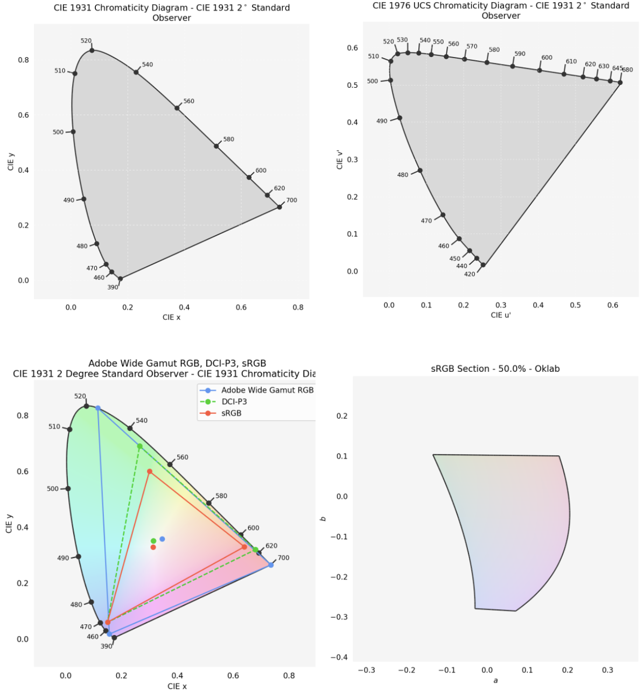
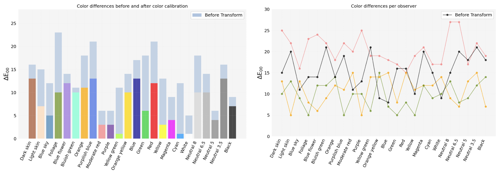
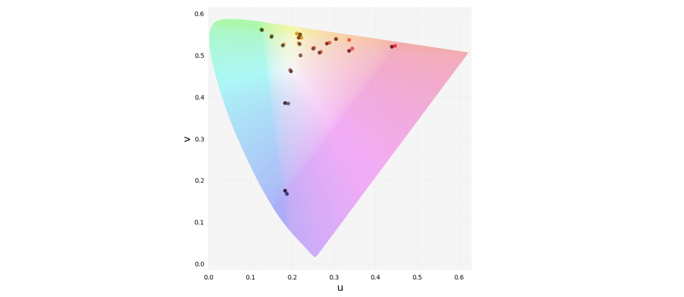

# Color Science plots

    <a href="#types-of-plots">Types of plots</a> |
    <a href="#references">References</a>   

Here you can find Color Science plot designs that you can use for visualizing data, color differences, and color diagrams. 

## Types of plots

### Chromaticity diagrams

Jupyter notebook: [ColorScience_Plots](./ColorScience_Plots.ipynb)

### Color differences ColorChecker

Color differences per ColorChecker patch. Jupyter notebook: [ColorChecker_Plots](./ColorChecker_Plots.ipynb)

### Data in CIELuv

Each dot corresponds to an observer selection. The color of the points approximates the selected color. Jupyter notebook: [ColorData_CIELuv](./ColorData_CIELuv.ipynb)

## References

* https://matplotlib.org/
* https://github.com/nschloe/colorio
* https://www.colour-science.org/
* https://python-colormath.readthedocs.io/en/latest/

